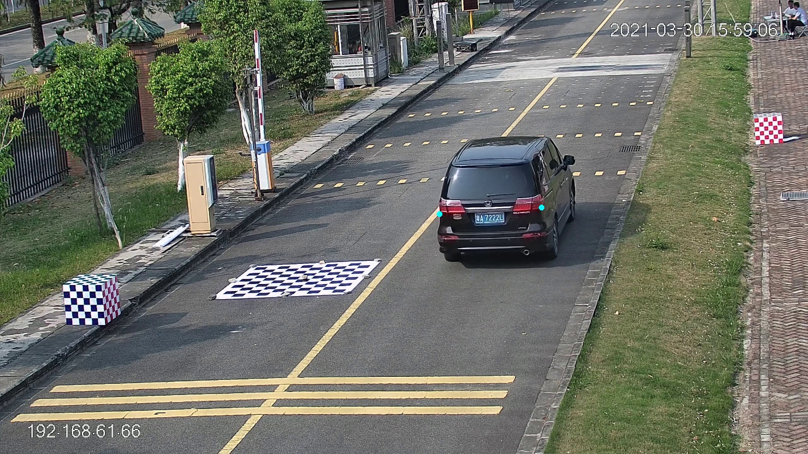

# Vehicle_Orientation_Detect

This is a two-stage vehicle orientation detection algorithm.

- the **camera calibration stage** based on **vanishing point detecting**
- the **vehicle orientation detection stage** based on **keypoints detect** and **Perspective Transformation**

## Environment

- all used python packages are displayed in [`requirement.txt`](./requirements.txt)
- torch 1.10.2 + CUDA 10.2
- python 3.7
- [TensorRT 8.2](https://developer.nvidia.com/tensorrt-getting-started)

## Simple Usage

- beginning with [`app.py`](./app.py)
    - all parameters
        - `source` (required) the video path
        - `engine` (required) the path of yolov5 TensorRT engine
        - `classes` (optional) the json file containing all detect targets
        - `roi` (optional) whether select the ROI of the scenarios，the default value is False
        - `caliFlag` (required) the True value represents **calibration stage**, the False value represents **
          orientation detection stage**
        - `calibration` (required when caliFlag is False) the utilized calibration file in second stage
        - `threshold` (optional) the threshold filtering vehicle edgelets, the default value is 0.5
        - `visualize` (optional) whether visualize the process of getting vehicle edgelets, the default value is False
        - `savePath` (required when caliFlag is True) the saving path of calibration file in calibration stage


- camera calibration stage

```shell
python app.py --source ${video path} --engine ${tensorRT engine} --caliFlag True --savePath ${calibration savePath}
```

- orientation detect stage

```shell
python app.py --source ${video path} --engine ${tensorRT engine} --caliFlag False --calibration ${calibration path}
```

## Program Structure

- `detection_model` the main modules of vehicle orientation detection(calibration and detection)
    - `calibration_yolo_model.py` the entire model based on yolov5 detector in workflow
    - `calibration_ssd_model.py`  the entire model based on SSD detector in workflow
    - `diamondSpace.py` the module implement a transformation from Cartesian coordinate system to Diamond Space
    - `edgelets.py` the module provides function for detecting vehicle edges
- `SSD` SSD detectors and inference api
- `yolov5` yolov5 detectors optimized by TensorRT and inference api
- `results` experiment result data
- `test` some test samples and script for test experiment
- `image` images and tables generated during the experiment
- `app.py` the entrance of entire program

## Dataset

- the roadside surveillance video captured by Guangzhou East Campus of Sun Yat-sen University
    - containing four kinds of data captured by different focal length and camera position camera
    - dataset structure
        - `calibrate` folder. A piece of surveillance video used to calibrate.
        - `eval` folder. A piece of surveillance video used to detect the orientation of vehicle.

## Workflow

### Camera Calibration

- Camera Calibration Based on Vanishing Point
    - build the camera model
      
    - calculate the intrinsic matrix and rotation matrix by two vanishing point
      coordinates.(`detection_model/calibration_utils.py computeCameraCalibration()`)

- Vanishing Points Detect
    1. first VP
        - Get the ROI of image by yolov5 object detector, Then detect the harris point of the region as feature points.
        - track the vehicles by using KLT tracker(**optical flow method**) to track feature points.
        - map all tracks gathered in last step to **DiamondSpace** to get the intersections(which is considered as **
          First VP**)
        - Get the first vanishing point by voting algorithm
    2. second VP
        - detect the high quality vehicle edgelets.
        - utilize the same method applied before to get the second VP.

### Orientation Detection

- KeyPoint Detect
    - Based on an 2D human position estimation network project[openpifpaf](https://github.com/openpifpaf/openpifpaf)
    - we get a pair of keypoints which can represent the orientation of vehicle(such as car lights)
      

- Get Bird-View image plane
    - utilize the calibration result to map all pixel to bird-view image.
    - calculate the slope of key point connection as the orientation of vehicle.